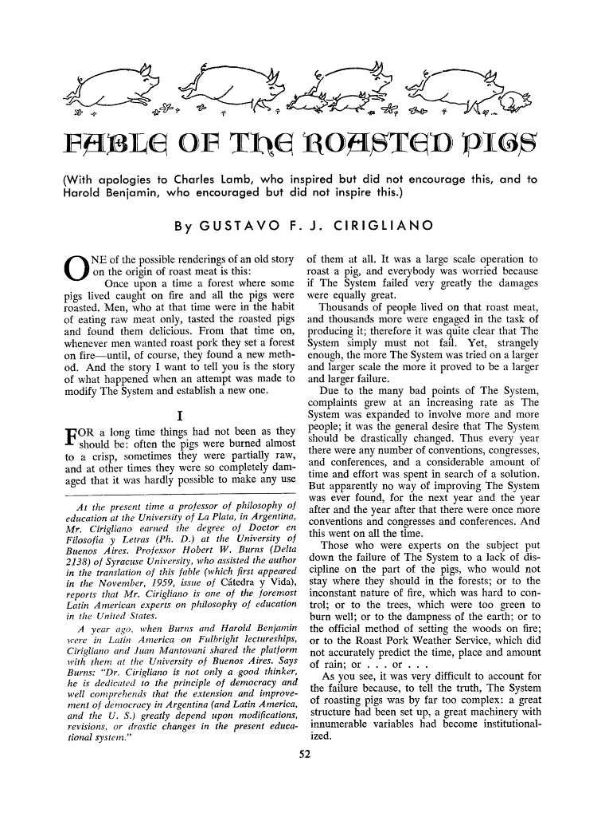
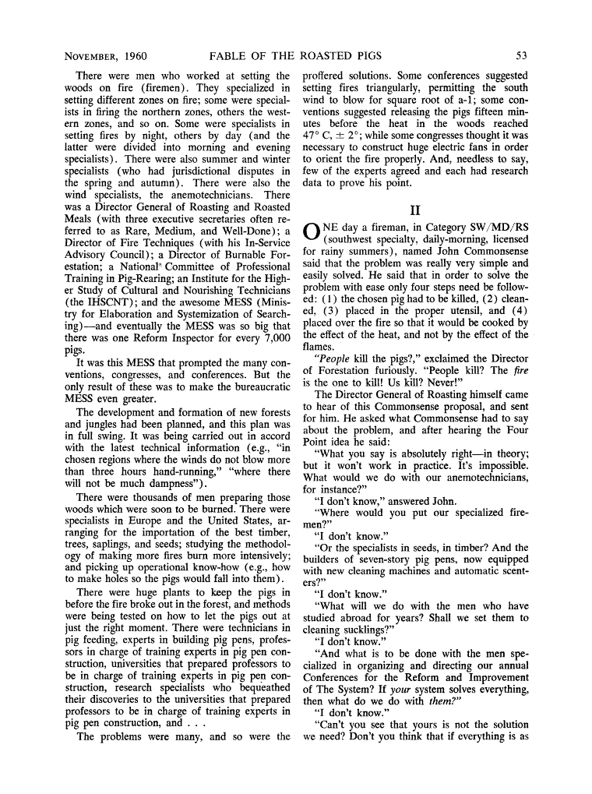
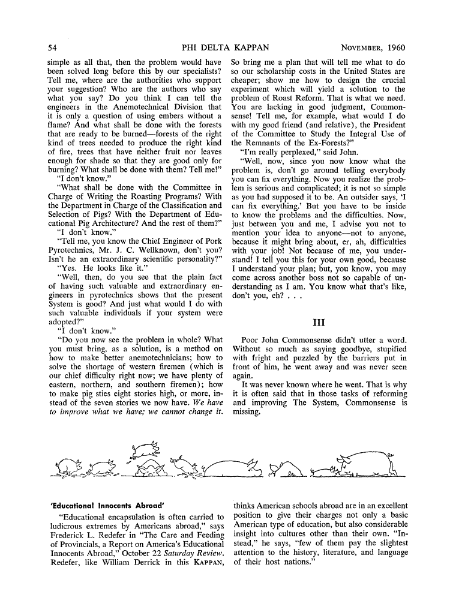

# Fable of the Roasted Pigs

*by* **Cirigliano, Gustavo F. J.** [^1] [^2]

Brazilian Portuguese:

English Version [^3] :

[^1]: **Gustavo F. J. Cirigliano** : Doctor of Philosophy and Letters from the U.B.A. – Professor at the National University of La Plata in 1958, Syracuse U. (USA 1961), Nacional del Litoral (1963), Zulia (Venezuela, 1964), UBA (1966), P.U Católica del Perú (1976) , AN. Open (Venezuela, 1977), National of Mar del Plata (1984), N. of Patagonia (1986). Between 1981 and 1984, he taught Transactional Analysis courses applied to Education at the Universities of Alicante, UNED, Murcia, Seville, Autonomous University of Barcelona, ​​Granada, Cádiz and Polytechnic University of Madrid.

[^2]: *Author of*: «Education and the Future» and «Philosophy of Education» (1967), «Education and Politics»(1969), «Trial to the School» (Joint work with Helba Forcade and Ivan Illich, 1972), «Education for a Social Change”, joint work with Paulo Freire; «The Argentine project. From Education to Politics» (1973), «La Argentina Triangular» (1975) «Open Education» (1983), «Educación y País» (1988), «Because I need Light to continue» (1995), «¿ Why did Clara J. Armstrong come to Argentina?» (1996), «Tangology» (2001), «Methodology of the Country Project» (2002), «Oswego in Argentine normalism» (2003) among countless other works, writings and journalistic articles.

[^3]: [*Cirigliano, Gustavo F. J.*](http://www.jstor.org/stable/20342499) “Fable of the Roasted Pigs.” The Phi Delta Kappan, vol. 42, no. 2, 1960, pp. 52–54. Accessed 9 Apr. 2022.
